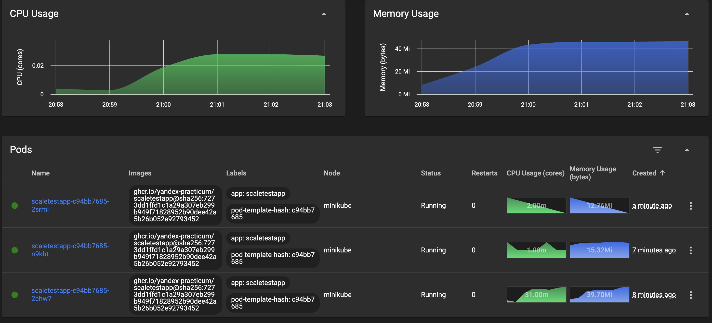
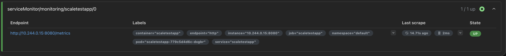
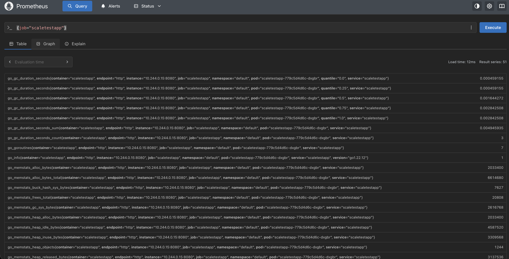
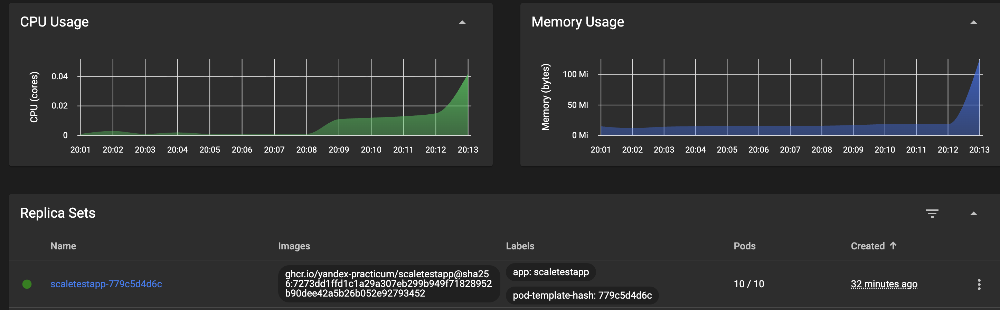

# architecture-insuretech

# Задание 1

# Задание 2

## Часть 1. Динамическая маршрутизация на основании показателей утилизации памяти

Количеcтво увеличилось до 3

Событие увеличения

## Часть 2. Динамическая маршрутизация на основании показателей количества запросов в секунду

### Метрики

### Реплики

Количество увеличилось до 10

Событие увеличения

