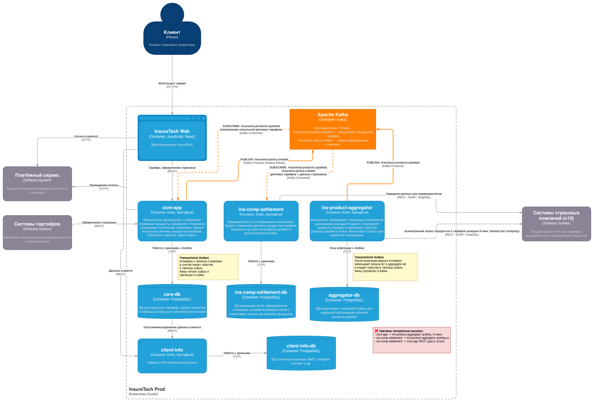

# Задание 3. Переход на Event-Driven архитектуру

## Проблемы и риски текущей архитектуры

| #   | Проблема                                                                                                                  | Риск                                                                              |
| --- | ------------------------------------------------------------------------------------------------------------------------- | --------------------------------------------------------------------------------- |
| 1   | `ins-product-aggregator` синхронно опрашивает все 5 страховых компаний в рамках одного HTTP-запроса                       | Одна медленная/упавшая компания блокирует ответ для всех потребителей             |
| 2   | С добавлением 5 новых компаний (итого 10) проблема №1 усугубляется кратно                                                 | Риск timeout-ов и каскадных сбоев                                                 |
| 3   | `core-app` и `ins-comp-settlement` опрашивают `ins-product-aggregator` по расписанию (pull-модель: 15 мин / 1 раз в ночь) | Лишняя нагрузка, данные могут быть устаревшими в промежутке между опросами        |
| 4   | `ins-comp-settlement` получает список оформленных страховок из `core-app` по REST (раз в сутки ночью)                     | Синхронная зависимость между сервисами, риск потери данных при сбое одного из них |

## Диаграмма

[InsureTech_C4_container-diagram-event-driven.drawio.xml](./InsureTech_C4_container-diagram-event-driven.drawio.xml)

